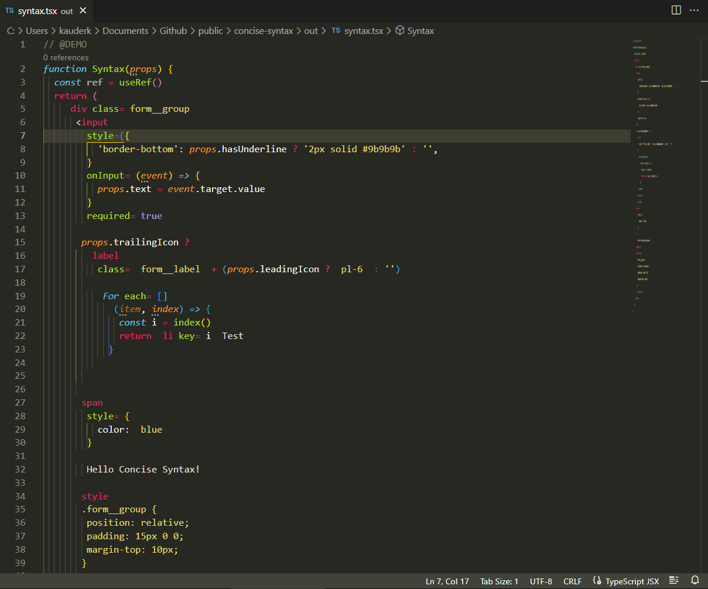

# concise-syntax



1. What does it do?
	- It toggles the visibility of unnecessary syntax.
2. Why and when to use it?
	- It is easier to read code when there is less syntax.
	- You may not use it when you are writing code.
3. How does it work?
	- It uses tokenColors rules along with a window script to synchronize the visibility of syntax.

## Usage

- Install the extension.
	- Download the latest vsix asset from the [releases page](https://github.com/kauderk/concise-syntax/releases).
	- Install it:
		- View > Command Palette > `Extensions: Install from VSIX...`
		- Or with `code --install-extension concise-syntax-0.0.1.vsix`.
	
- Usage
	- Open a workspace folder.
	- Open a concise-syntax target document: **typescriptreact** (any flavour is supported).
	- An info message will appear `The extension is not calibrated. Shall we calibrate it?` click `Yes`.

- Runtime:
	- Then you'll have access to a command palette command `Concise Syntax: Calibrate`
		- Use this command to manually calibrate the extension to your theme/settings.json.
	- When ever you change your workspace theme and the extension is active, you'll be prompted to calibrate the extension or deactivate it.

- Configuration:
	- File > Preferences > Settings > Extensions > Concise Syntax
	- There, you can tune the opacities and their hierarchy.

## Development
- Launch the vscode `debugger` with `F5`. A warning will appear `The task "watch" cannot be tracked. Make sure to have a problem matcher defined`, click `Remember my choice for this task` and `Debug Anyway`.
	- Why does this happen? The build script `vite.config.custom.ts` needs to build the extension and the window side. That script doesn't have a problem matcher defined in `.vscode/tasks.json` so vscode doesn't know how to track it. The warning is harmless and can be ignored.
- To package the extension install `vsce` with `npm install -g vsce` and run `vsce package`.

## Known Issues

- `Your Code installation appears to be corrupt. Please reinstall.`
	- The extension spawns a window script and vscode doesn't like that. That script syncs the window state with the extension.

- This extension is a workaround for a feature that is not yet available in VSCode.
	- Which is the ability to toggle tokenColors and or apply partial theme rules.
It is highly over engineered for what it does: toggle css styles on and off.
That being said, it is a proof of concept about how to communicate between the extension and the window.
	
	<details>
		<summary>More</summary>
		Glims of hope	- The following shows how simple it could be to toggle tokenColors.
	
	https://github.com/microsoft/vscode/issues/157087#issuecomment-1225889161
	```json
	"editor.semanticTokenColorCustomizations": {
		"[Extension]": {
			"rules": {
				"veriable.readonly": "#95E6CD"
			}
		}
	}
	"editor.semanticTokenColorCustomizations": {
		"[Extension]": {
			"enabled": false
		}
	}
	```
	</details>
